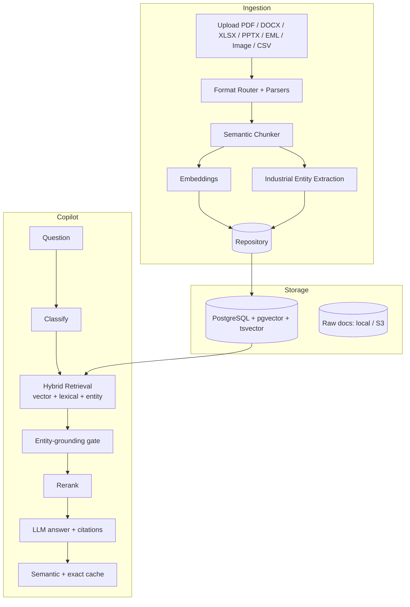

# Mantra — Industrial Knowledge Intelligence Backend

Mantra is a **retrieval-first backend for industrial document intelligence**. It ingests
heterogeneous plant documents (engineering notes, maintenance work orders, inspection
reports, SOPs, OEM manuals, equipment registers, emails, scanned forms), extracts
operational entities, builds a lightweight industrial knowledge graph, and answers
natural-language questions with **cited, source-grounded evidence**.

## Overview

Industrial operations run across many disconnected document systems — drawings in one
place, work orders in another, procedures and inspection records elsewhere. Mantra makes
that collective knowledge **queryable, connected, and useful at the point of need**.

The backend focuses on two capabilities, hardened toward production:

1. **Universal Document Ingestion & Knowledge Graph** — multi-format ingestion, industrial
   entity extraction, and a heterogeneous knowledge graph that links documents to the
   equipment, procedures, regulations, people, and parts they reference.
2. **Expert Knowledge Copilot** — a RAG copilot that answers operational and maintenance
   questions with source citations, page/chunk provenance, and a calibrated confidence
   label.

## Architecture



**Core design**

- **API** — FastAPI async application with a lifespan-managed singleton service graph
  (services instantiated once and wired into the app state).
- **Persistence** — SQLAlchemy 2.0 (async). SQLite for local development, **PostgreSQL +
  `pgvector`** for production, with Alembic-managed schema.
- **Retrieval** — a single, unified hybrid score used identically across backends:
  semantic vector similarity (pgvector `<=>`) + lexical relevance (PostgreSQL `tsvector`
  full-text / a BM25-lite fallback) + industrial-entity overlap + exact-phrase match, each
  normalized to a `[0, 1]` scale with shared confidence thresholds. The SQLite and
  PostgreSQL paths are proven to agree on ranking classification and confidence.
- **Storage** — raw documents persisted through a `LocalStorage` / S3-compatible
  abstraction for reprocessing and citation link-back.
- **Parsing** — adapter-based parsers for text/markdown/CSV, PDF (PyMuPDF), DOCX
  (python-docx), PPTX (python-pptx), XLSX (openpyxl), EML, and image OCR (Tesseract).
- **Entity extraction** — deterministic regex + curated failure terms + a
  **site-calibratable equipment ontology** (ISA-5.1-style aliases). Coded and spelled-out
  references resolve to one canonical tag (`P-101A`, `P101A`, and `Pump 101-A` → `P101A`);
  2-letter tags (`HX-2042`) are distinguished from vendor part numbers (`SKF-6312`). The
  ontology is overridable per site via a JSON file referenced by an environment variable.
- **Knowledge graph** — heterogeneous nodes (documents, equipment, procedures, regulations,
  personnel, parts) connected by `references` and `co_occurs` edges, with equipment-centric
  subgraphs.
- **Copilot orchestration** — a LangGraph workflow: prepare → cache lookup → retrieve →
  rerank → generate → cache writeback. An **entity-grounding gate** ensures asset-specific
  questions are answered only from documents that mention the named asset, and every stage
  has a deterministic fallback.
- **Model layer** — a deterministic offline provider plus **NVIDIA-hosted open models**
  (OpenAI-compatible API) for answer generation, reranking, and safety. Every LLM feature
  degrades gracefully to deterministic, source-grounded output.
- **Caching** — a corpus-versioned PostgreSQL semantic cache (invalidated on ingestion so
  answers never go stale) with an optional Redis exact-cache L1.
- **Security baseline** — optional API-key protection (constant-time comparison), persisted
  request audit events, sanitized raw-document downloads, and secrets loaded only from
  runtime environment (never committed).

## Data flow

```
Upload → format router → parse / OCR → semantic chunk → embed
      → industrial entity extraction → SHA-256 dedup → persist (chunks, entities, graph)

Question → classify → hybrid retrieval (vector + lexical + entity)
        → entity-grounding gate → rerank → LLM answer with citations → cache
```

## Tech stack

| Layer | Technology |
|---|---|
| API | FastAPI (Python 3.11), async |
| Database | PostgreSQL + `pgvector` (prod) · SQLite (dev) |
| Full-text search | PostgreSQL `tsvector` |
| ORM / migrations | SQLAlchemy 2.0 (async) · Alembic |
| Embeddings | deterministic hashing (default) · `BAAI/bge-base-en-v1.5` via sentence-transformers (optional) |
| Parsing / OCR | PyMuPDF · python-docx · python-pptx · openpyxl · eml · Tesseract |
| Copilot orchestration | LangGraph |
| Models | deterministic offline provider · NVIDIA-hosted open models |
| Caching | PostgreSQL semantic cache · optional Redis L1 |
| Object storage | local filesystem · S3-compatible |

## Repository contents

This repository contains the backend application and its dependencies:

- `backend/app/` — the FastAPI application: configuration, data models, repository layer,
  storage abstraction, and services (ingestion, parsers, chunking, entity extraction,
  embeddings, retrieval scoring, copilot orchestration, model providers, caching).
- `requirements.txt` — core runtime dependencies.
- `requirements-ml.txt` — optional heavier NLP dependencies (spaCy, sentence-transformers,
  scikit-learn, torch) for production-quality embeddings.

## Running (local development)

```bash
python3 -m pip install -r requirements.txt
uvicorn backend.app.main:app --reload
```

By default the app runs against SQLite with an application-level hybrid retrieval path and
a deterministic (offline, zero-cost) model provider, so it starts with no external services
or API keys. Configuration is entirely environment-driven via `IKI_*` variables (repository
backend, database URL, storage backend, embedding backend, LLM provider and model IDs,
optional API key, and an optional equipment-ontology override path).

For production, point the app at **PostgreSQL + `pgvector`** (Alembic-managed schema), enable
the NVIDIA model provider, and optionally enable Redis and sentence-transformer embeddings.
Provide runtime secrets (e.g. an NVIDIA API key) via a local, untracked environment file —
never commit secrets.

## API

| Method | Path | Purpose |
|---|---|---|
| `POST` | `/api/documents/upload` | Ingest a document |
| `GET` | `/api/documents/{id}` | Document detail with extracted entities |
| `GET` | `/api/documents/{id}/raw` | Original stored bytes (citation link-back) |
| `GET` | `/api/knowledge-graph` | Full knowledge graph (nodes + edges) |
| `GET` | `/api/knowledge-graph/equipment/{tag}` | Equipment-centric subgraph |
| `POST` | `/api/copilot/ask` | Ask a question; returns a cited, confidence-scored answer |
| `GET` | `/api/health` | Service + repository status |

Interactive API docs (Swagger UI) are available at `/docs` when the server is running.
